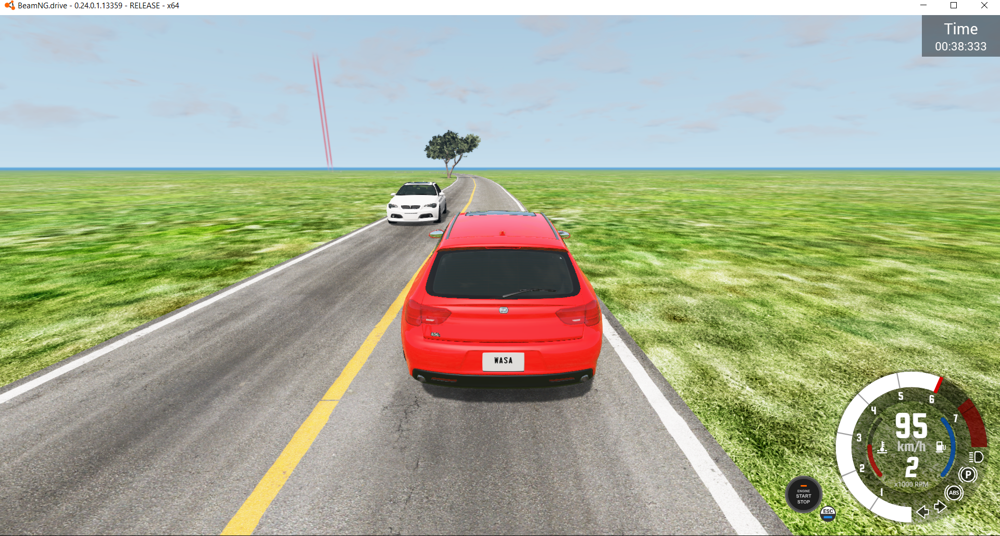

# Test Runner
This tool serves as a proof of concept of the possibility of simulating of Advanced Driver Assistance Systems (ADAS) 
test scenarios defined using the Meta-Model-based visual editor proposed 
by Basciani, Cortellessa, Di Martino, [Di Nucci](https://https://dardin88.github.io/), 
[Di Pompeo](https://danieledipompeo.github.io), Gravino, and [Starace](https://luistar.github.io) in a research 
paper titled "*ADAS Verification in Co-Simulation: Towards a Meta-Model for Defining Test Scenarios*", which has been accepted for presentation at the [19th Workshop on Advances in Model Based Testing (A-MOST 2023)](https://conf.researchr.org/home/icst-2023/a-most-2023).

The tool takes as input a preliminary CSV representation of a test scenario produced by the modelling framework and simulates the
test scenario using the well-known [BeamNG.tech](https://beamng.tech) platform, capturing a number of relevant metrics.

# Requirements
This tool requires BeamNG.tech 0.24 to be installed. Builds of BeamNG.tech are made available for non-commercial use upon 
request using [this form](https://register.beamng.tech/).

# Instructions

The base level directory (provided in the [`tig.zip`](tig.zip) archive in this repository) needs to be extracted and 
copied in the BeamNG.tech user directory. Assuming the BeamNG.tech user directory is `D:/BeamNG_user/`, the base
level directory should be placed in `D:/BeamNG_user/0.24/levels/`.

The tool can then be started by running `test_runner.py`. The script needs three command line arguments:
* `beamng-home`: path to the BeamNG.tech installation directory
* `beamng-user`: path to the BeamNG.tech user directory
* `test-scenario`: name of the test scenario to be executed. This must be the name of a CSV file in the /scenarios 
  directory (with no extension).

An example of command to start the script is reported as follows.
```
python test_runner.py --beamng-home="D:/BeamNG/" --beamng-user="D:/BeamNG_user/" --test-scenario="scenario"
```

The simulation results are saved in a JSON file with the same name of the test scenario in the `/output/` 
directory. A sample output file is available [here](output/scenario.json).

# Screen captures
Two frames from the BeamNG.tech simulation of the provided sample test scenario (`scenario.csv`) are shown as follows.


# Acknowledgements
This work has been partially supported by the Italian PNRR MUR project PE0000013-FAIR.
